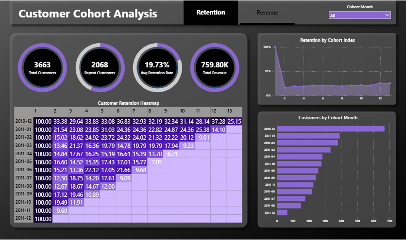
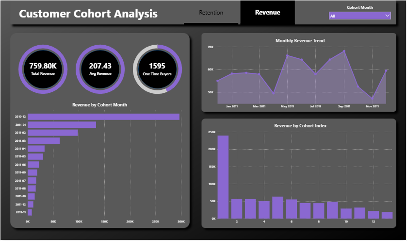

# Customer Cohort Analysis

## Project Overview
This project focuses on analyzing customer retention, repeat purchasing behavior, and revenue trends using Cohort Analysis. The analysis was performed using SQL for data transformation and Power BI for interactive dashboard visualization.

The dashboard helps identify customer engagement patterns, retention performance, and long-term customer value contribution across different cohorts.

---

## Objectives
- Analyze customer retention behavior over time
- Identify repeat purchasing patterns
- Measure cohort-wise customer performance
- Understand revenue contribution from different cohorts
- Track customer lifecycle trends
- Generate business insights for improving customer retention

---

## Dataset Description
The dataset contains online retail transaction records including:
- Customer IDs
- Invoice Dates
- Product Purchases
- Quantity
- Unit Price
- Revenue
- Country Information

The data spans multiple months, allowing cohort-based retention analysis and repeat customer tracking.

---

## Tools & Technologies Used
- **Excel** – Data cleaning and preprocessing
- **MySQL** – Cohort analysis and SQL transformations
- **Power BI** – Dashboard creation and visualization
- **DAX** – KPI calculations and measures

---

## Data Cleaning & Preprocessing
The dataset was cleaned in Excel before analysis:
- Removed null Customer IDs
- Removed cancelled transactions
- Removed duplicate records
- Removed invalid quantity and price values
- Created Revenue column
- Created OrderMonth column for monthly analysis
- Standardized date formatting for SQL import

---

## Project Workflow

### Step 1 – Data Cleaning
Performed preprocessing and removed invalid records using Excel.

### Step 2 – SQL Cohort Analysis
Used MySQL to:
- Identify customer first purchase month
- Create Cohort Month
- Calculate Cohort Index
- Build retention tables
- Calculate retention percentages

### Step 3 – Power BI Dashboard Development
Imported transformed tables into Power BI and created:
- KPIs
- Cohort heatmap
- Revenue analysis visuals
- Retention trend analysis
- Customer behavior insights

---

## SQL Analysis Performed

### 1. Cohort Month Identification
Identified the first purchase month of each customer.

### 2. Cohort Index Calculation
Calculated the number of months between first purchase and repeat purchases.

### 3. Retention Analysis
Created customer retention tables to analyze repeat customer behavior across cohorts.

### 4. Revenue Analysis
Analyzed revenue trends and revenue contribution by customer cohorts.

---

## Dashboard Pages

### 1. Retention Analysis
This page focuses on customer retention behavior and repeat purchasing trends.

#### Visuals Included
- Customer Retention Heatmap
- Retention Trend Analysis
- Cohort-wise Customer Distribution
- Repeat Customer Analysis
- Retention KPIs

---

### 2. Revenue Insights
This page focuses on revenue contribution and customer value analysis.

#### Visuals Included
- Revenue by Cohort
- Monthly Revenue Trend
- Revenue by Cohort Index
- Revenue KPIs
- One-Time Buyer Analysis

---

## KPIs Used
- Total Customers
- Repeat Customers
- Average Retention Rate
- Total Revenue
- Average Revenue Per Customer
- One-Time Buyers

---

## Key Business Insights
- Customer retention decreases significantly after the first purchase month
- Only a portion of customers return for repeat purchases
- Certain customer cohorts contribute higher long-term revenue
- Repeat customers generate a significant share of overall revenue
- Revenue contribution declines gradually across lifecycle months

---

## Business Recommendations
- Improve customer retention through loyalty programs
- Target first-time buyers with personalized campaigns
- Increase repeat purchases using retention-focused strategies
- Focus marketing efforts on high-value customer cohorts
- Monitor low-performing cohorts to reduce customer churn

---

## Conclusion
This project demonstrates how cohort analysis can be used to understand customer retention, repeat purchasing behavior, and revenue contribution patterns. By combining SQL-based cohort analysis with Power BI visualizations, the dashboard provides actionable business insights for improving customer engagement and long-term customer value.

---

## Author
**Umesh Harsana**  
B.Tech, IIT(BHU) Varanasi  
Aspiring Data Analyst
